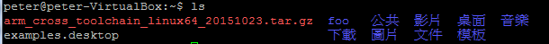

# 第五章：安裝組語需要的Toolchains (Easy way)
## 1. 到Ecourse 上下載老師編譯好的arm-elf-* ToolChain
可以用 ```wget $(下載點)```下載到當前目錄。<br/>
或是```curl $(下載點) -o $(你的檔案名稱)```
## 2. 解壓縮
```tar zxvf $(剛剛下載的檔案) ```<br/>解壓縮後會產生一個**"foo"**資料夾

## 3. 安裝一些相依的套件(重要)


