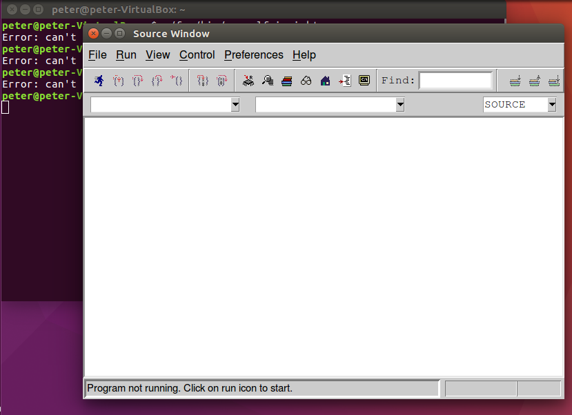

# 第五章：安裝組語需要的Toolchains (Easy way)
## 1. 到Ecourse 上下載老師編譯好的arm-elf-* ToolChain
可以用 ```wget 下載點```下載到當前目錄。<br/>
或是```curl 下載點 -o 你的檔案名稱```
## 2. 解壓縮
```tar zxvf 剛剛下載的檔案 ```<br/>解壓縮後會產生一個**"foo"**資料夾

## 3. 安裝一些相依的套件(重要)
```sudo apt-get install libtk8.5 itcl3 itk3 iwidgets4```
## 4. 測試arm-elf-insight 是否可以執行

## 5. 設定arm-elf-* 的$PATH 環境變數
###臨時：
```PATH=$PATH: 你的arm-elf-*所在路徑，就是foo/bin的路徑```
###登入時自動設定：
