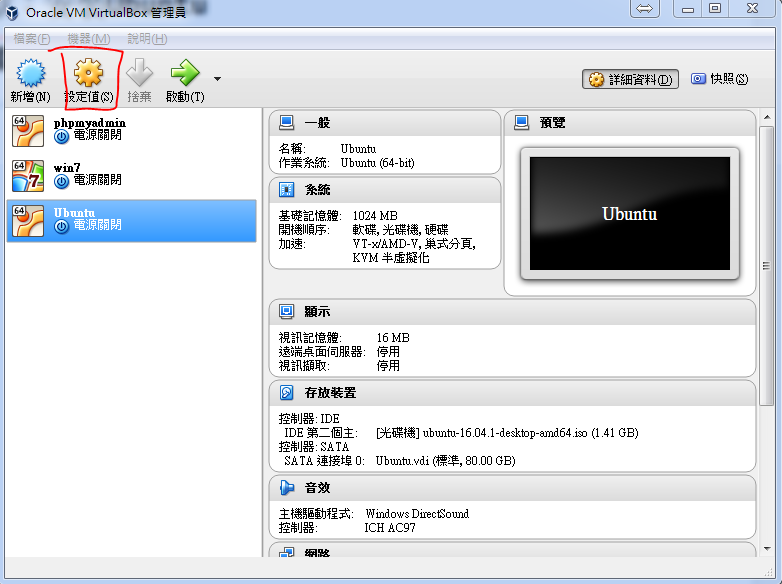
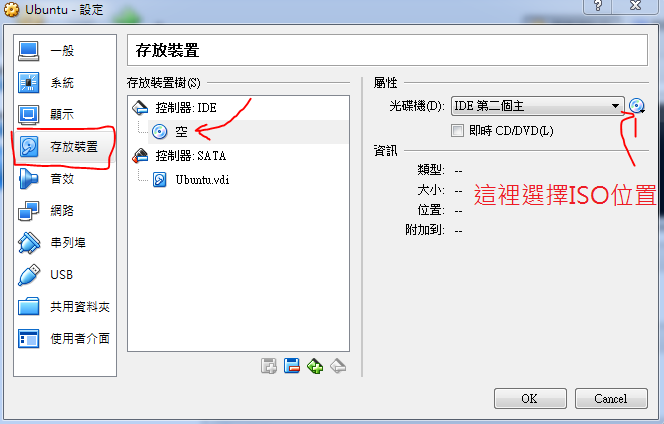
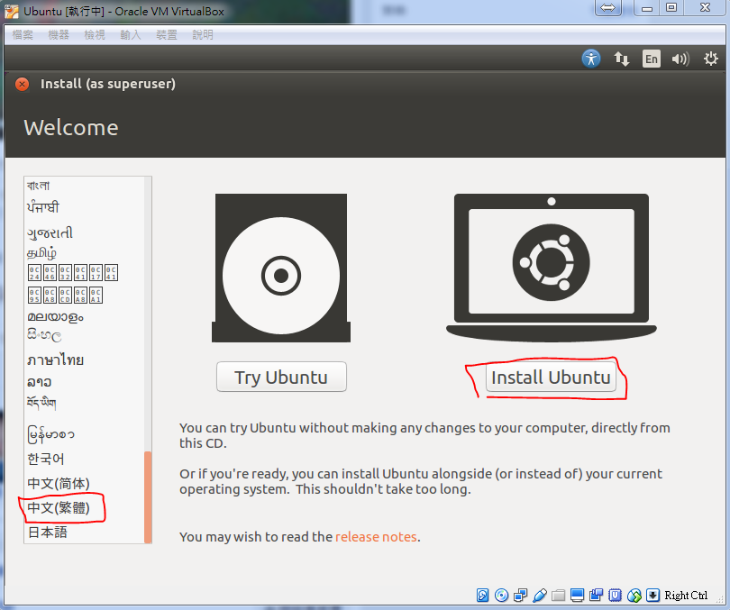
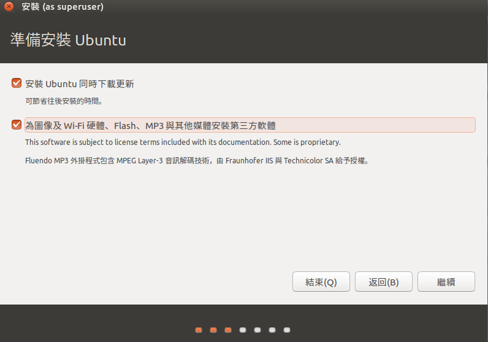
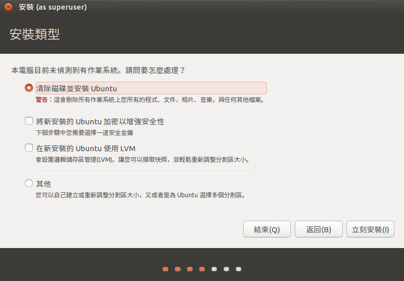
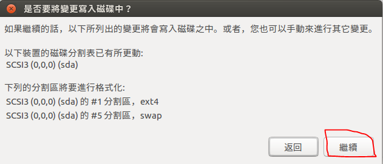
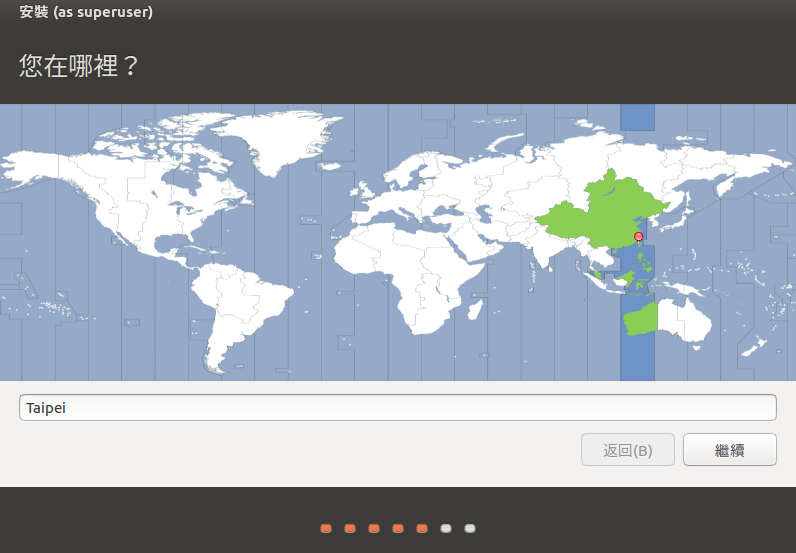
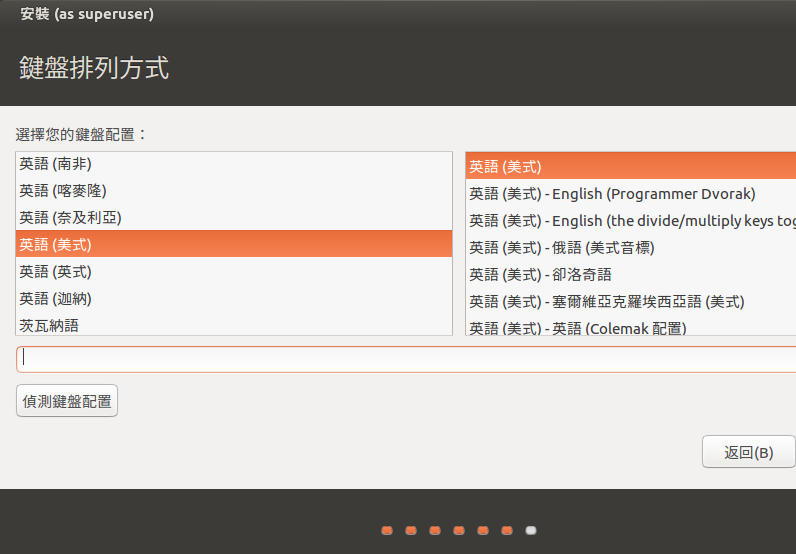
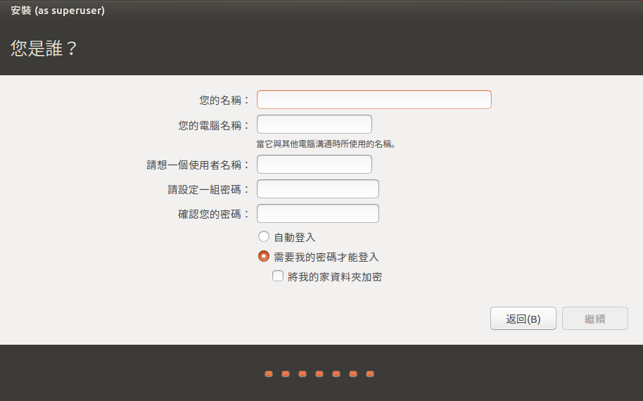

# 第二章：安裝Ubuntu

## 下載
到 [https://www.ubuntu.com/](https://www.ubuntu.com/) 下載最新的Ubuntu (現在是16.04)。
## 安裝

### 選擇映像檔

### 然後啟動，進入Ubuntu 安裝介面
#### 選擇安裝語言

#### 下載更新與驅動程式

#### 格式化硬碟

#### 選擇時區

#### 選擇KeyMapping方式 (重要!!!選擇"美式"鍵盤)

#### 設定管理員帳號/密碼

### 安裝完成！
