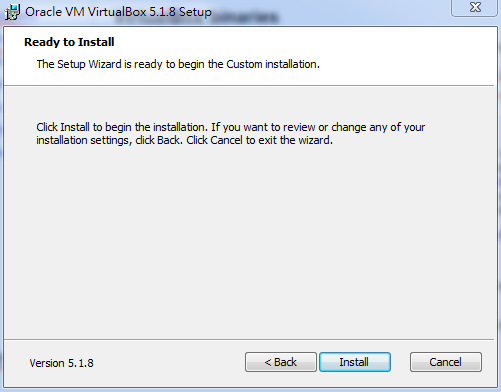

# 第一章：安裝Ubuntu

可以使用Virtual Box 在不同的作業系統上，使用獨立的Linux 環境，在這裡介紹Ubuntu 在Virtual Box 裡的安裝過程。

## 安裝Virtual Box：

### 下載

最新的Virtual Box 可以在 [https://www.virtualbox.org/](https://www.virtualbox.org/) 取得，

選擇要使用的作業系統版本，[點擊](http://download.virtualbox.org/virtualbox/5.1.8/VirtualBox-5.1.8-111374-Win.exe)下載。

### 安裝
](04.PNG)](03.PNG)](02.PNG)](01.PNG)

