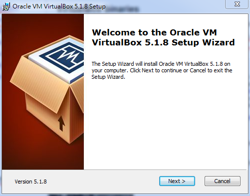
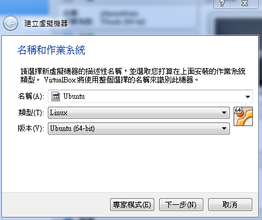
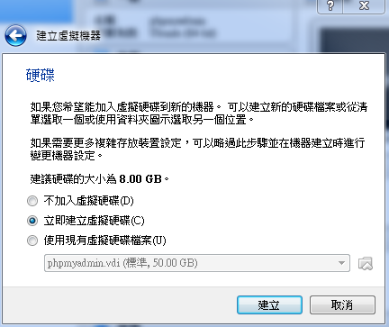
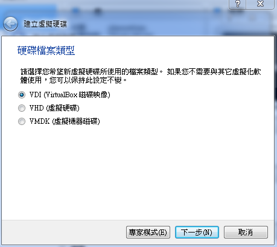
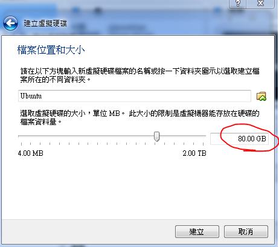

# 第一章：使用VirtualBox

可以使用VirtualBox 在不同的作業系統上，使用獨立的Linux 環境，在這裡介紹Ubuntu 在VirtualBox 裡的安裝過程。

## 安裝VirtualBox：

### 下載

最新的Virtual Box 可以在 [https://www.virtualbox.org/](https://www.virtualbox.org/) 取得，

選擇要使用的作業系統版本，[點擊](http://download.virtualbox.org/virtualbox/5.1.8/VirtualBox-5.1.8-111374-Win.exe)下載。

### 安裝

## 在VirtualBox 上新增虛擬機器：
到 [https://www.ubuntu.com/](https://www.ubuntu.com/) 下載最新的Ubuntu (現在是16.04)。

### 新增一個虛擬機器

