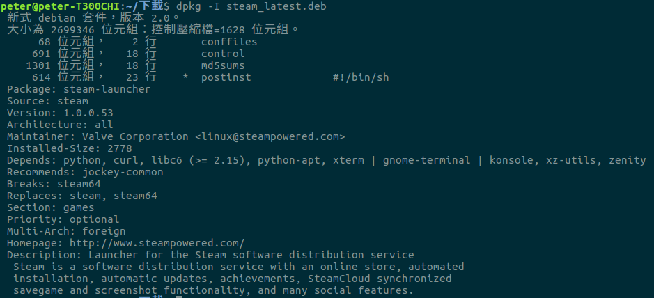

# 6-1：使用 .deb 包
在這裡暫時先示範幾個常見的指令
##安裝與移除
安裝：```sudo dpkg -i 你的deb包.deb```<br/>
移除：```sudo dpkg -r 你的deb_Package名稱```<br/>
清理設定檔：```sudo dpkg --purge 你的deb_Package名稱```<br/>
##察看.deb包詳細資訊
察看.deb 資訊：```dpkg -I 你的deb包.deb```<br/>
以網路上的steam 包為例：<br/>

從**"Package: "**欄位，察看該deb 檔對應的Package 名稱。<br/>
從**"Version: "**欄位，察看該Package 版本。<br/>
從**"Depends: "**欄位，差看該Package 相依於哪些套件。
##列出所有已安裝的Packages 
```dpkg --list```<br/>

##重設特定Package 設定檔
指令：<br/><br/>
```sudo dpkg-reconfigure 套件名稱```